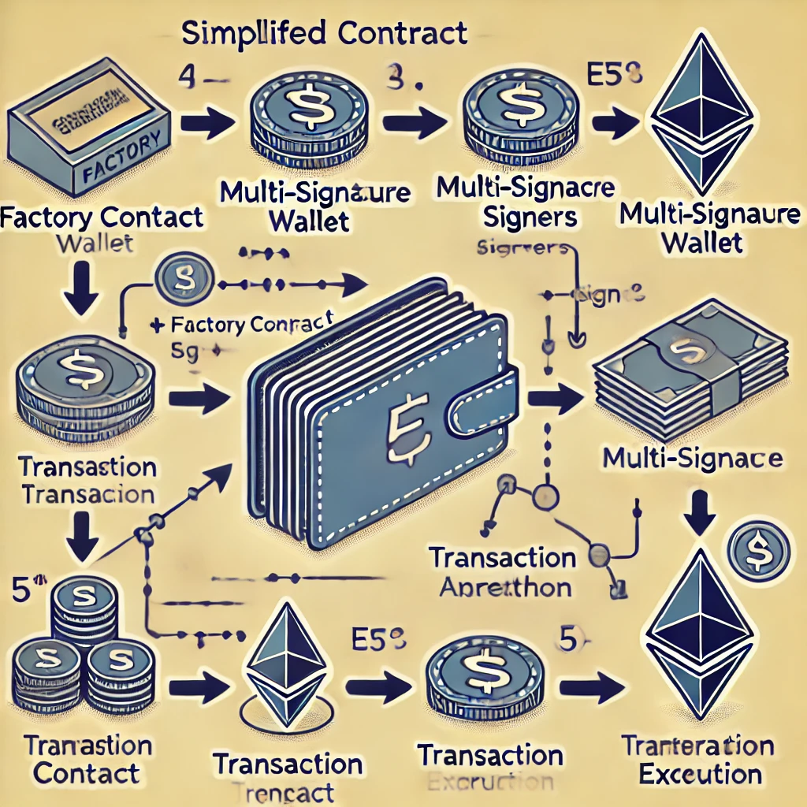

# Multi-Signature Wallet Client

This project is a client application built with [Next.js](https://nextjs.org/) that allows users to create and manage multi-signature wallets. A multi-signature wallet requires multiple signers to approve transactions before they are executed, providing an additional layer of security.

## Features

- **Create Wallets**: Users can create a new multi-signature wallet by specifying the number of signers and the threshold required to execute transactions.
- **Manage Wallets**: View wallet details, including signers and pending transactions.
- **Initiate Transactions**: Propose transactions that require approval from multiple signers.
- **Approve Transactions**: Signers can approve or reject transactions, which will only be executed once the threshold is met.
- **Token Transfers**: Users can initiate transfers of ERC-20 tokens from the multi-signature wallet to other addresses.
- **Smart Contract Interactions**: The wallet can interact with other smart contracts, allowing users to call contract functions with multi-signature approval.

## Prerequisites

- **[MetaMask](https://metamask.io/)** or any other Ethereum-related wallet: Required for interacting with the Ethereum blockchain through the application.
- **Node.js** v14 or higher
- **npm** v6 or higher or **yarn** v1.22 or higher

## Contract Interactions

The multi-signature wallet allows for secure and flexible interactions with the Ethereum blockchain. Users can:

- **Transfer Tokens**: Easily transfer ERC-20 tokens from the wallet to any Ethereum address. The transfer will only be executed once the required number of signers have approved the transaction.
- **Interact with Smart Contracts**: Call functions on other smart contracts, enabling complex operations like DeFi interactions, staking, or governance voting.

## Mind Map

The following mind map illustrates the overall flow and structure of the Multi-Signature Wallet Client application:

This diagram provides a visual representation of how different components interact within the system, including wallet creation, transaction proposals, approvals, and execution.

## Tech Stack

- **[Next.js](https://nextjs.org/)**: A React framework for building fast, modern web applications.
- **[TypeScript](https://www.typescriptlang.org/)**: For type-safe coding and a better development experience.
- **[Tailwind CSS](https://tailwindcss.com/)**: A utility-first CSS framework for styling.
- **[Web3.js](https://web3js.readthedocs.io/)**: A JavaScript library for interacting with the Ethereum blockchain.

## Smart Contract

The smart contract used by this application can be found in the following repository: [Multi-Sig Smart Contract](https://github.com/luffy487/multi-sig). This contract handles the logic for multi-signature wallets, including transaction proposals, approvals, and execution.

